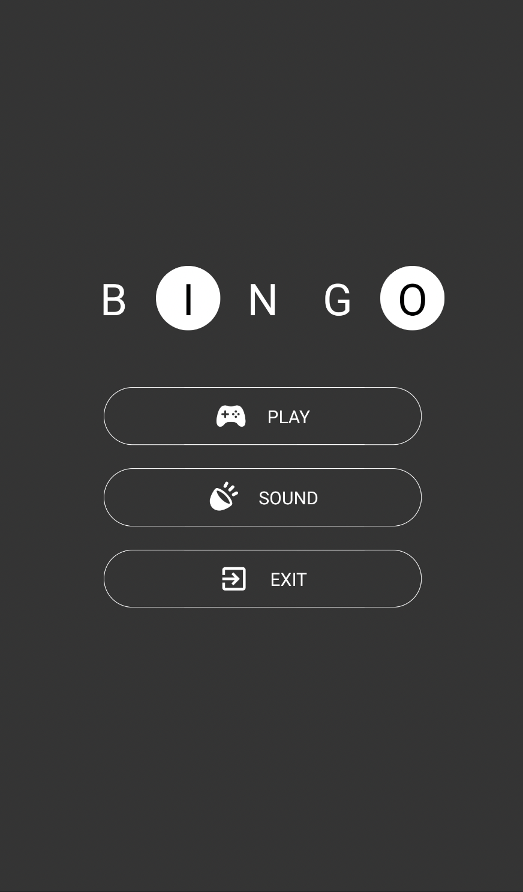
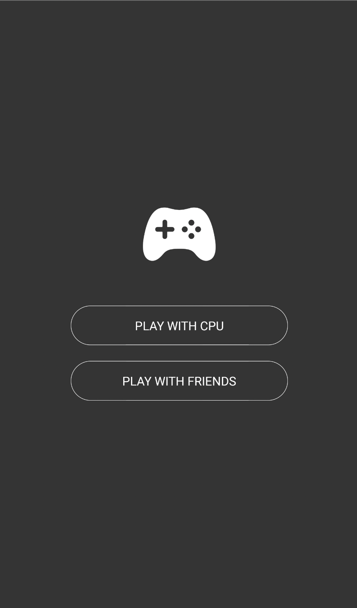
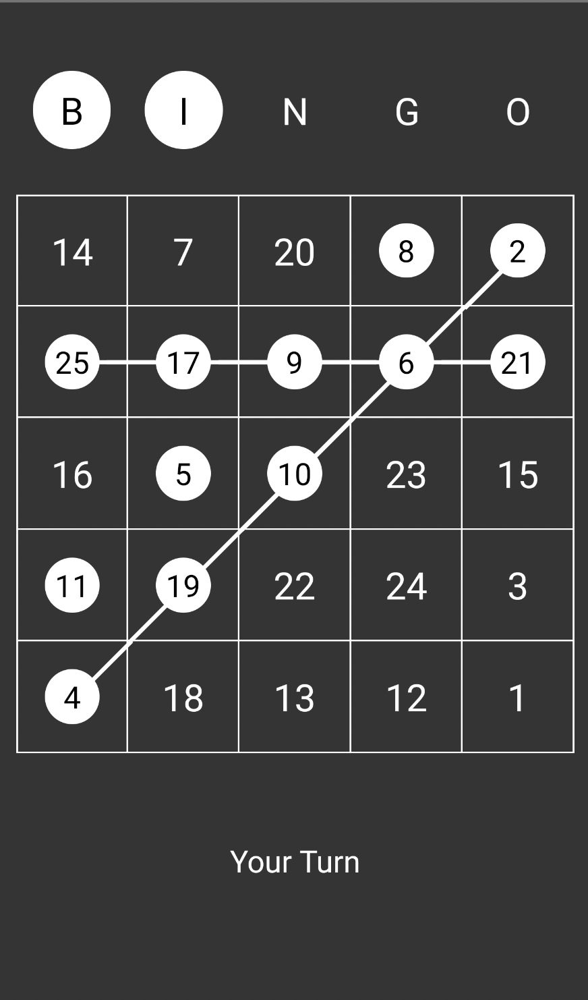
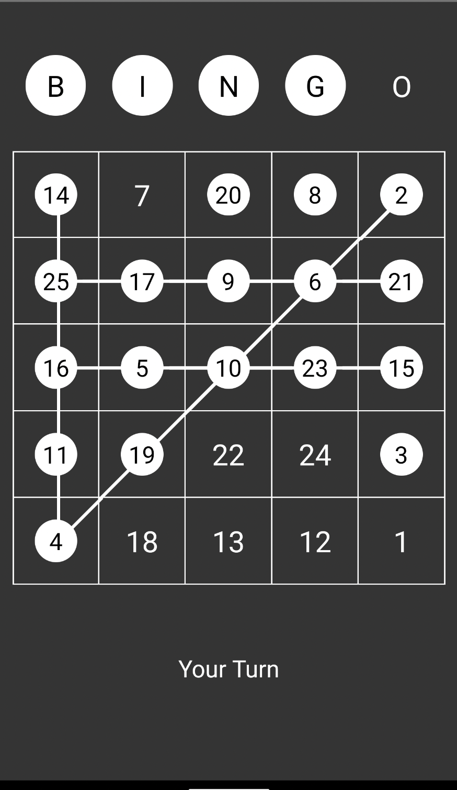

# Bingo Mobile Multiplayer Game

Simple Bingo game which can be played with CPU or with your friends. I used to play this game when I was in school using pen and paper with my friends
and now I can play it anytime with this application.

It is also deployed in playstore: https://play.google.com/store/apps/details?id=com.bingomultiplayergame

   

## Technologies

- React Native
- PeerJs for brokering the connection between two player using WebRTC

## How to run in local machine

- clone the repo
- run `npm install`
- run `npm start`
- open a new terminal and run `react-native run-android`
